**Software Engineer | Backend Systems & Distributed Infrastructure**

I build backend systems and developer infrastructure, with a focus on system architecture, reliability, and correctness under failure. I'm particularly interested in distributed systems, low-level software, operating systems, and networking.

- ⚙️ **Engineering philosophy:** I believe in building simple interfaces over complex systems, with reliability, observability, and maintainability as first-class concerns.
- 🌱 **Open source:** I enjoy understanding large codebases and contributing to software used beyond my own projects.
- 🐧 **Environment:** Linux native (Arch).

---

### 💻 Tech Stack

---

### 📊 GitHub Stats

