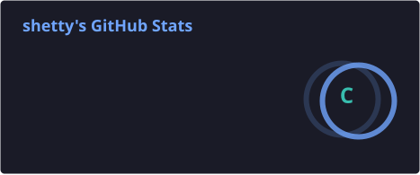
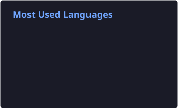

**Systems Software | OS Internals, Drivers & the Network Datapath**

I work on software close to the hardware: how drivers behave when devices misbehave, how packets move from the NIC to a socket, and where latency actually goes. I care about correctness under failure, and I'd rather measure a system than guess about it.

- 🔧 **Now:** building **Hostile Device** — a harness that plays a failing emulated PCIe device against real, unmodified Linux drivers under load, and judges whether they recover
- 🐧 **Lab:** a debug mainline kernel in QEMU with gdb attached (KASAN, lockdep, kmemleak) — kernel modules and drivers get written and broken there, never on the host
- 📚 **Learning in public:** C++ from the ground up (RAII, move semantics, memory ordering, cache-aware layout), C in its kernel dialect, computer architecture, and the Linux networking stack
- 🌱 **Open source:** Apache Pulsar contributor; currently reading [rdma-core](https://github.com/linux-rdma/rdma-core) ahead of contributing
- ⚙️ **Philosophy:** every design gets a deliberately injected failure before I trust it

---

### 🛠️ Projects

| Project | What it is | Stack |
|---|---|---|
| **Hostile Device** *(in progress)* | Fault injection at the PCIe boundary: event-triggered faults (withheld interrupts, all-1's reads after surprise removal, bogus completions) in QEMU device models, run against upstream drivers carrying real traffic. Every finding replays deterministically | C, QEMU, Linux kernel |
| **Rewind** | Local-first snapshot system — content-defined chunking, Zstandard reverse deltas, SQLite manifests. Two research papers on it | Go, SQLite |
| **Styx** | VPN built from scratch — control plane and packet engine split across a Unix domain socket, ChaCha20-Poly1305 | Rust, Java |
### 🌱 Open Source

- **Apache Pulsar** — Redis sink connector: [ACL support + TLS hardening (#126)](https://github.com/apache/pulsar-connectors/pull/126), [TLS peer verification and truststore support (#135)](https://github.com/apache/pulsar-connectors/pull/135)

---

### 💻 Tech Stack

---

### 📊 GitHub Stats

